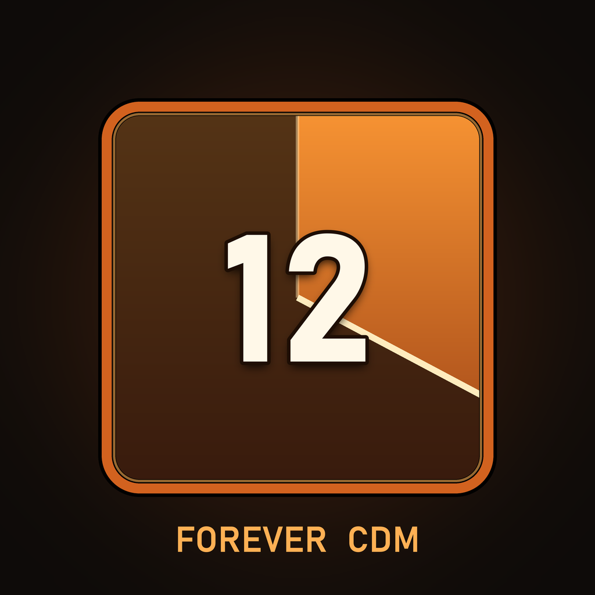

# ForeverCDM



A cooldown manager for **World of Warcraft: Forever** that needs no Blizzard Cooldown Manager data.

Blizzard's Cooldown Manager has no authored data for Forever classes yet, so every addon that skins
it shows nothing. ForeverCDM reads your spellbook and your auras directly and draws its own icon rows.

**Author:** Thunderz · **Interface:** 16001 (Forever beta)

## What it does
- Four icon rows: **Cooldowns**, **Utilities**, **Buffs**, **Debuffs**. Cooldown rows show Blizzard's
  swipe and charge counts; the Buffs row shows chosen auras while they are on you, and the Debuffs row
  shows your own debuffs on your target (Serpent Sting, Rend...), each with a remaining-time swipe.
- Auras that are not up are hidden until they happen (good for procs), or can stay dimmed on the bar.
  Finishers such as Slice and Dice show the length that matches the combo points spent.
- The Cooldowns and Utility bars show only spells on cooldown (option "Hide ready cooldowns"), and
  every bar keeps its visible icons centred, spreading evenly to both sides.
- Combine icons: spells of which only one is up at a time (seals, auras, aspects, stings) can share
  one icon that lights up with whichever is on. Use the + button in the Bars card.
- Each character keeps its own tracked spells (see Tracking profiles below).
- Out of combat the bars can stay, fade or hide; they come back in combat and on an enemy target.
- Display only. It never casts and never makes decisions, so it stays inside the current addon rules.
- Reads nothing it is not allowed to: secret timings are handed to the cooldown widget as duration
  objects, and in combat, where the client hides aura data from addons entirely, a buff that was up
  keeps its ticking timer, slightly dimmed, instead of vanishing.

## Use
Type `/fcdm` to open the settings window: your spellbook with a tick box per row for each spell,
Up/Down ordering per row, icon size and spacing, lock/unlock for dragging, and a box to add a spell
by name or ID. `/fcdm help` lists the slash commands for people who prefer them.

### Positioning rows in Edit Mode
Open **Game Menu > Edit Mode** to show labelled drag handles for Cooldowns, Utilities,
Buffs and Debuffs, even if a row is empty or normally locked. Drag a handle to position its row.
Closing Edit Mode restores your normal lock setting; `/fcdm unlock` and `/fcdm lock`
still work for moving rows outside Edit Mode. Handles are disabled during combat.

**Right-click a row handle in Edit Mode** to anchor it to a Blizzard Edit Mode frame
or another ForeverCDM row. The row stays in place when attached, then follows that
frame as it moves. Drag the row to adjust its offset. Choose **Screen (detach)** to
return to a fixed screen position without moving it. Circular anchors are excluded.
The menu lists only currently visible targets; attach and detach actions print a
confirmation in chat. Duplicate target labels include their global frame names.
For a named frame not listed in the menu, use `/fcdm anchor buffs FrameName`
(replace `buffs` with `cds` or `utilities` as needed); `/fcdm anchor buffs none` detaches.
If the target is unavailable at login, the row uses its saved screen position and
reconnects when the target's addon finishes loading or on entering the world.

Turn on **Enable Snap** in Edit Mode to align a row with nearby visible Blizzard
frames, other ForeverCDM rows, or its current anchor. Blue guides preview matching
centres and edges (including touching edges); releasing the mouse snaps within a
10 UI-pixel tolerance. Hold **Shift** to move freely. Snapping aligns the row without
attaching it automatically; an existing anchor is kept and its offset is updated.

Positions save **immediately on drop** in ForeverCDM's existing character settings
(and its optional settings macro). They are shared across Blizzard Edit Mode layouts;
Blizzard's Save, Revert, and layout import/export do not manage these addon positions.
An attached row will nevertheless follow its target when a Blizzard layout moves it.
On the beta, enable **Keep settings in a macro** if the client forgets your settings
between game sessions.

## Tracking profiles

Each character keeps its own tracked spells, in a profile named after it
(`Name (Class) - Realm`) that is created the first time it logs in. Characters are told
apart by their GUID, since two characters can share a first name. The ordered lists for Cooldowns, Utilities,
Buffs and Debuffs (tracked items included) belong to the profile; positions, anchors,
sizes, appearance and learned buff durations are shared by every character. Edits save
automatically.

The **Profile** menu at the top of `/fcdm` switches this character to another profile.
Type a name beside it and choose **New** for empty lists, **Copy** to duplicate the
current lists, or **Rename** to rename the current profile. **Delete** removes the typed
name. Two characters can share a profile: renaming it takes both along, and a profile
another character uses cannot be deleted. Profile changes are blocked in combat.

The same actions are available as `/fcdm profile new PvP`, `/fcdm profile copy Raid`,
`/fcdm profile use Raid`, `/fcdm profile rename Solo` and `/fcdm profile delete Raid`.
`/fcdm profile` lists them. Names are case-sensitive and can contain spaces (up to 48
bytes, no control characters or `|`).

Lists saved before profiles existed go to the character they belong to: its own settings
macro if it has one, otherwise the character whose spellbook has those spells. Until that
character logs in they wait as a profile called **Default**.

On the beta, each character's settings macro holds that character's profile, named after its
GUID. A macro from an older version, named after name and realm, is taken over only by the
character whose spells it holds. Profiles no character uses ride along while they fit;
`/fcdm mirror` shows the backup status.
`/fcdm reset` resets the shared layout and this character's lists, and keeps other
characters' profiles.

## Install
Drop the `ForeverCDM` folder into `World of Warcraft\_classic_beta_\Interface\AddOns\`.

## Development
Tests run under Lua 5.2+ with no game client:
```
lua tests/test_secret_duration.lua ForeverCDM.lua
lua tests/test_runtime.lua
lua tests/test_runtime.lua edit-mode-open
lua tests/test_runtime.lua no-edit-mode
lua tests/test_cast_tracking.lua
lua tests/test_persist.lua
lua tests/test_debuffs.lua
lua tests/test_combine.lua
```
For an in-game Edit Mode check:
1. `/reload`, then open Game Menu > Edit Mode while the rows are locked. All three
   labelled handles should appear, including any empty row.
2. Drag each row, close Edit Mode, and `/reload`. Positions should remain and the
   locked rows should pass clicks through again.
3. Repeat with `/fcdm unlock`; leaving Edit Mode should keep the rows unlocked.
4. Verify a combat transition stops dragging and hides handles. After combat,
   the handles should reflect whether Edit Mode or manual unlock is still active.
5. Check at your usual UI scale. Switching Blizzard layouts or using Revert should
   leave unanchored ForeverCDM positions unchanged, as explained above.
6. Right-click a row, choose Player Frame or another row, then move the target.
   Check that the row follows, dragging it changes the offset, and `/reload`
   preserves the attachment. Choose Screen (detach) and verify it stays in place.
7. With Enable Snap on, drag a row close to a frame's centre or edge. Check the blue
   guides and alignment on release. Repeat with Shift held and Enable Snap off;
   neither should snap. Test an attached row and a different UI scale as well.

Releases are built by the GitHub Actions workflow on any `v*` tag. Findings about the Forever client
that shaped this addon live in [forever-addon-kit](https://github.com/Thunderz96/forever-addon-kit).

MIT.
